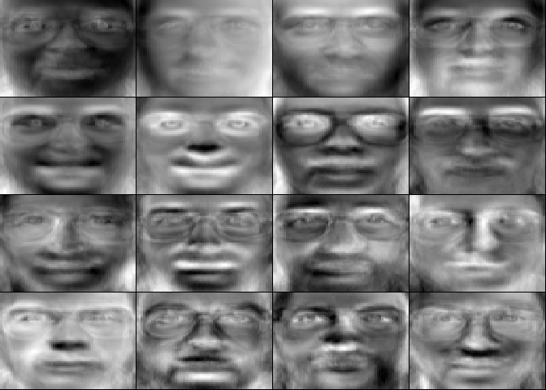

---
output:
  github_document
---


```{r setup, include=FALSE}
knitr::opts_chunk$set(
  fig.path = "Figures/",
  comment = "#>",
  collapse = TRUE
  )
library(knitr)
```
This repository  provides an R script in file "eigenfaces.R" for the computer vision problem of human face recognition. Eigenfaces are ghostly face images (see below) which represent a set of eigenvectors used in this computer vision problem of human face recognition. 



A set of these eigenfaces can be generated by performing a principal component analysis (PCA) with the application of the SVD on a large set of train face images. Eigenfaces can be considered as a set of "standardized face ingredients". Any face is a combination of these standard faces. For example, one's face might be composed of the average face plus 15% of eigenface 16% of eigenface 2, and −5% of eigenface 3. These percentages are coefficients or weights which are then used to recognize faces. 

When a new test face is presented for classification, its own weights are found by deducting the average train face and projecting this result onto the set of the eigenfaces generated earlier in PCA on the train faces. This provides a vector of weights describing this new train face. These weights are then compared with the weights of each train face in order to find the closest match by using the Euclidean distance between two vectors.

More theoretical background can be found in:

* Strang Gilbert, [Introduction to Linear Algebra](https://math.mit.edu/~gs/linearalgebra/), 5th Edition, Wellesley-Cambridge Press, 2016 (see [6.1 Introduction to Eigenvalues and Eigenvectors](https://math.mit.edu/~gs/linearalgebra/linearalgebra5_6-1.pdf), [7.1 Image Processing by Linear Algebra](https://math.mit.edu/~gs/linearalgebra/linearalgebra5_7-1.pdf), 7.3 Principal Component Analysis (PCA by the SVD))
* Turk, Matthew A. and Pentland, Alex P., [Face recognition using eigenfaces](https://www.cin.ufpe.br/~rps/Artigos/Face%20Recognition%20Using%20Eigenfaces.pdf). Computer Vision and Pattern Recognition, 1991. Proceedings, IEEE Computer Society Conference in 1991

When performing human face recognition, the code in file "eigenfaces.R" includes the following three main parts:

* libraries, functions and data
* principal component analysis
* face recognition

##Libraries, functions and data
Set working directory to source file location. Then, install and load libraries:
```{r message=FALSE, warning=FALSE}
if(!(require(dplyr))){install.packages('dplyr')}
library(dplyr)
```
This script will use extensively the `%>%` operator of `dplyr`.

Define a function to show face images: 
```{r}
showFace <- function(x){
  x %>%
  as.numeric() %>%
  matrix(nrow = 64, byrow = TRUE) %>% 
  apply(2, rev) %>%  
  t %>% 
  image(col=grey(seq(0, 1, length=256)), xaxt="n", yaxt="n")
  }
```

The purpose of this function is to convert a vector with the image into a matrix and "fix" R function `image` which present images with 90 degree counter-clockwise rotation.

Define a function to calculate the Euclidean distance between two vectors with weights:
```{r}
calDif <- function(x){
  ((x-coefTestSel) %*% t(x-coefTestSel)) %>%
    sqrt
}
```
This function will be used in the test exercise.

Load data with face images:
```{r}
dataX <- "olivetti_X.csv" %>% 
  read.csv(header=FALSE) %>% 
  data.frame()
str(dataX, list.len = 5)
```
The loaded csv file contains data of face images taken between April 1992 and April 1994 at AT&T Laboratories Cambridge. Each row contains data of one image quantized to 256 grey levels between 0 and 1. After loading, the data are converted into a data frame.

Display first 40 face images selected from the dataset:
```{r}
par(mfrow=c(4, 10))
par(mar=c(0.05, 0.05, 0.05, 0.05))
for (i in 1:40) {
  showFace(dataX[i, ])
  }
```

Create labels:
```{r}
dataY<-seq(1:40) %>% 
  rep(each=10) %>% 
  data.frame() %>% # 
  mutate(index = row_number()) %>% 
  select(2, label = 1) 
str(dataY)
```

A sequence of label numbers from 1 to 40 corresponding to 40 persons is created. Each label number is replicate 10 times as we have 10 face images in sequence for each person. The data are converted into a data frame. A column with indices is added. The index column is moved to the front and a name is given to the column with labels.

The data with image faces will be split into train data and test data. In the first step, determine the indices of the data to be included in either the train data or the test data:
```{r}
set.seed(1234)
trainSampInd <- dataY %>%
  group_by(label) %>%
  sample_n(8) %>% 
  arrange(index)
testSampInd <-  setdiff(dataY, trainSampInd)
```

The data should be grouped by label. 8 indices of face images are sampled from each group and set in one group for the test data. The results are sort out by index. The non-sampled indices will be used for the test data.

In the second step, select image faces for the train data:
```{r}
dataMat <- dataX %>%
  filter(row_number() %in% trainSampInd[, "index", drop=TRUE]) %>%
  data.matrix() %>%
  `rownames<-`(trainSampInd[, "label", drop=TRUE])
str(dataMat, list.len = 5)
```

and for the test data: 
```{r}
testDataMat <- dataX %>%
  filter(row_number() %in% testSampInd[, "index", drop=TRUE]) %>%
  data.matrix() %>%
  `rownames<-`(testSampInd[, "label", drop=TRUE])
str(testDataMat)
```

Compute and display the average face (mean by each column):
```{r}
avFace <- colMeans(dataMat)
showFace(avFace)
```

Center data:
```{r}
dataMatCen <- scale(dataMat, center = TRUE, scale = FALSE)
```


##Principal component analysis
We can either calculate a covariance matrix and its eigenvectors with eigenvalues (less numerically stable) or conduct singular value decomposition (svd - more numerically stable). This is the code to calculate the covariance matrix and its eigenvectors with eigenvalues: 
```{r eval=FALSE}
covMat <- t(dataMatCen) %*% dataMatCen / nrow(dataMat-1) 
eig <- eigen(covMat)
eigVec <- eig$vectors 
eigVal <- eig$values 
```

The eigenvectors (eigenfaces) of the covariance matrix as unit define axes of the principal components. The corresponding eigenvalues define variances along the axes of the principal components. 
This is the code to conduct singular value decomposition which is a better choice:
```{r}
svd <- svd(dataMatCen)
eigVec <- svd$v 
str(eigVec)
eigVal <- svd$d^2/(ncol(dataMatCen)-1) 
str(eigVal)
```

The eigenvectors of the covariance matrix are equal to the right singular vectors of svd. The eigenvalues of the covariance matrix are equal to the squared singular values divided by n-1, where n is the number of columns in the data matrix. 

Compute and display the proportions of variance explained by the principal components:
```{r}
varProp <- eigVal/sum(eigVal) 
varCumProp <- cumsum(eigVal)/sum(eigVal) 
par(mfrow=c(2, 1))
plot(varProp*100, xlab = "Eigenvalues", ylab = "Percentage", 
     main = "Proportion in the total variance")
plot(varCumProp*100, xlab = "Eigenvalues", ylab = "Percentage", 
     main = "Proportion of the cumulative variance in the total variance")
```

Select eigenvectors (eigenfaces):
```{r}
thresNum <- min(which(varCumProp > 0.95)) 
eigVecSel <-  eigVec[, 1:thresNum]
str(eigVecSel)
```
The selected principal components explain at least 95% of the total variance of the data.

Display the first sixteen eigenfaces:
```{r}
par(mfrow=c(4, 4))
par(mar=c(0.05, 0.05, 0.05, 0.05))
for (i in 1:16) {
  showFace(eigVecSel[, i])
}
```

Project the data matrix - where each row vector represent a face image - onto the space spanned by the selected eigenvectors (eigenfaces):
```{r}
coefTrainFaces <- dataMatCen %*% eigVecSel %>% 
  `rownames<-`(rownames(dataMat)) 
str(coefTrainFaces)
```
Coefficients (weights) for each train face are calculated. Each rowname with the coefficients will be the label of the corresponding face image.

Plot the coefficients for the first face image being the result of the projection of this image onto the eigenvectors:
```{r}
barplot(coefTrainFaces[1, ], 
    main = "Coefficients of the projection onto eigenvectors for the first image", 
    ylim = c(-8, 4))
```

Show the first image and its reconstruction using the coefficients and eigenvectors (eigenfaces):
```{r}
par(mfrow=c(1, 2))
par(mar=c(0.05, 0.05, 0.05, 0.05))
showFace((dataMat[1, ]))
(coefTrainFaces[1, ] %*% t(eigVecSel) + avFace) %>%
  showFace()
```

##Face recognition
Project the matrix with test data onto the space spanned by the eigenvectors determined by train data:
```{r}
coefTestFaces<- testDataMat %>% 
  apply(1, function(x) x-avFace) %>%  
  t %*% 
  eigVecSel 
```

The test data are used. The vector of the average face of the train data is deducted from each row vector of the test data matrix before transposing the row vectors with test images onto the space spanned by the eigenvectors of the covariance matrix of the train data.


Create an empty matrix to store the test results:
```{r}
testRes <- matrix(NA, nrow = 80, ncol = 3) %>%
  data.frame %>%
  `colnames<-`(c("Label of image", "Label identified in test",
      "Correct (1) / Wrong (0)"))
str(testRes)
```

Conduct the calculations of the recognition exercise for all the test faces:
```{r}
for (i in 1:nrow(coefTestFaces)) { 
  coefTestSel <- coefTestFaces[i, , drop=FALSE]
  difCoef <- apply(coefTrainFaces, 1, calDif)
  testRes[i, 1]  <- rownames(coefTestFaces)[i]
  testRes[i, 2] <- rownames(coefTrainFaces)[which(min(difCoef)==difCoef)]
}
```

The weights of `i` test face are compared with the weights of each train face in order to find the closest match. The Euclidean distance between two vectors with weights is calculated using function`calDif` defined at the begining of the script. 

Present the test results for the first ten test faces:
```{r}
testRes[, 3] <- ifelse(testRes[, 2] == testRes[, 1], 1, 0)
testRes[1:10, ]
```

Show the proportion of the successful recognition of the test faces: 
```{r}
(shareCor <- sum(testRes[, 3])/nrow(testRes))
```


