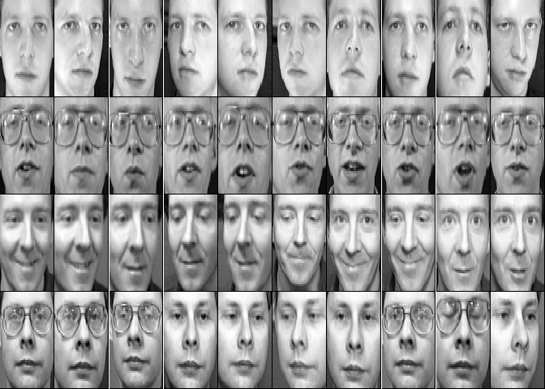
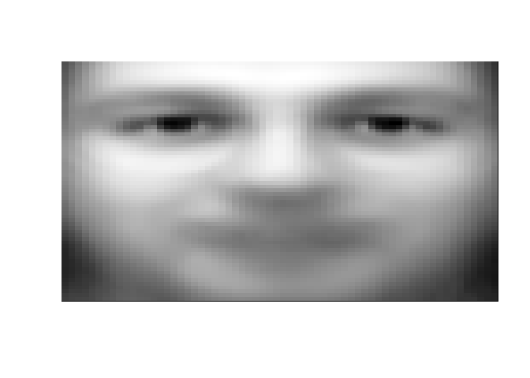
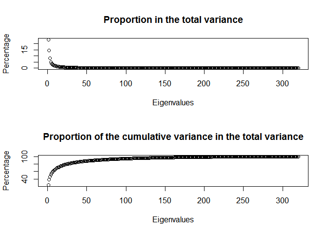
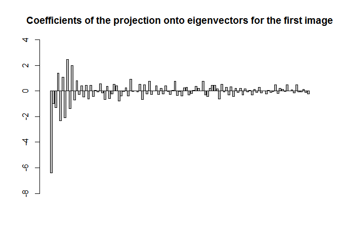
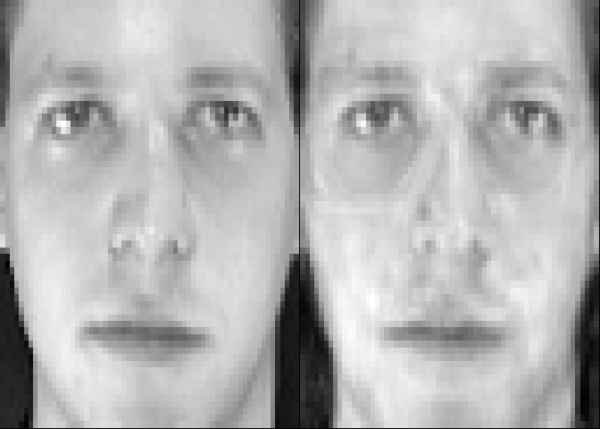

This project ..

Set working directory to source file location. Then, install and load libraries:

``` r
if(!(require(dplyr))){install.packages('dplyr')}
library(dplyr)
```

Define a function to show face images:

``` r
showFace <- function(x){
  x %>%
  as.numeric() %>%
  matrix(nrow = 64, byrow = TRUE) %>% 
  apply(2, rev) %>%  
  t %>% 
  image(col=grey(seq(0, 1, length=256)), xaxt="n", yaxt="n")
  }
```

The purpose of this function is to convert a vector with the image into a matrix and fix the issue concerning R function `image` which creates a grid with 90 degree counter-clockwise rotation of the conventional printed layout of a matrix.

Load data with face images:

``` r
dataX <- "olivetti_X.csv" %>% 
  read.csv(header=FALSE) %>% 
  data.frame()
```

The loaded csv file contains data of face images taken between April 1992 and April 1994 at AT&T Laboratories Cambridge. Each row contains data of one image quantized to 256 grey levels between 0 and 1. After loading, the data are converted into the data frame format.

Display faces selected from dataset:

``` r
par(mfrow=c(4, 10))
par(mar=c(0.05, 0.05, 0.05, 0.05))
for (i in 1:40) {
  showFace(dataX[i, ])
  }
```



Create labels:

``` r
dataY<-seq(1:40) %>% 
  rep(each=10) %>% 
  data.frame() %>% # 
  mutate(index = row_number()) %>% 
  select(2, label = 1) 
```

A sequence of label numbers from 1 to 40 corresponding to 40 persons is created. Each label number is replicate 10 times as we have 10 face images in sequence for each person. The data are converted into a data frame. A column with indices is added. The index column is moved to the front and a name is given to the column with labels.

The data with image faces will be split into training data and test data. In the first step, determine the indices of the data to be included in either the set of train data or the set of test data:

``` r
set.seed(1234)
trainSampInd <- dataY %>%
  group_by(label) %>%
  sample_n(8) %>% 
  arrange(index)
testSampInd <-  setdiff(dataY, trainSampInd) 
```

The data should be grouped by label. 8 indices of face images are sampled from each group and set in one group for the test data. The results are sort out by index. Non-sampled indices will be for the test data.

In the second step, select image faces for the train data:

``` r
dataMat <- dataX %>%
  filter(row_number() %in% trainSampInd[, "index", drop=TRUE]) %>%
  data.matrix() %>%
  `rownames<-`(trainSampInd[, "label", drop=TRUE])
```

and for the test data:

``` r
testDataMat <- dataX %>%
  filter(row_number() %in% testSampInd[, "index", drop=TRUE]) %>%
  data.matrix() %>%
  `rownames<-`(testSampInd[, "label", drop=TRUE])
```

Compute and display the average face (mean by each column):

``` r
avFace <- colMeans(dataMat)
showFace(avFace)
```



Center data:

``` r
dataMatCen <- scale(dataMat, center = TRUE, scale = FALSE)
```

We can either calculate a covariance matrix and its eigenvectors with eigenvalues (less numerically stable) or conduct singular value decomposition (svd - more numerically stable). This is the code to calculate the covariance matrix and its eigenvectors with eigenvalues:

``` r
covMat <- t(dataMatCen) %*% dataMatCen / nrow(dataMat-1) 
eig <- eigen(covMat)
eigVec <- eigvalues 
```

The eigenvectors (eigenfaces) of the covariance matrix as unit define axes of the principal components. The corresponding eigenvalues define variances along the axes of the principal components. This is the code to conduct singular value decomposition:

``` r
svd <- svd(dataMatCen)
eigVec <- svdd^2/(ncol(dataMatCen)-1) 
```

The eigenvectors of the covariance matrix are equal to the right singular vectors of svd. The eigenvalues of the covariance matrix are equal to the squared singular values divided by n-1, where n is the number of columns. Compute and display the proportions of variance explained by the principal components:

``` r
varProp <- eigVal/sum(eigVal) 
varCumProp <- cumsum(eigVal)/sum(eigVal) 
par(mfrow=c(1, 2))
plot(varProp*100, xlab = "Eigenvalues", ylab = "Percentage" , main = "Proportion in the total variance")
plot(varCumProp*100, xlab = "Eigenvalues", ylab = "Percentage" , main = "Proportion of the cumulative variance in the total variance")
```



Select eigenvectors (eigenfaces):

``` r
thresNum <- min(which(varCumProp > 0.95)) # Princiapal components explains at least 95% of the total variance
eigVecSel <-  eigVec[, 1:thresNum]
```

Display first 16 eigenfaces:

``` r
par(mfrow=c(4, 4))
par(mar=c(0.05, 0.05, 0.05, 0.05))
for (i in 1:16) {
  showFace(eigVecSel[, i])
}
```


Project the data matrix onto the space spanned by the selected eigenvectors

``` r
coefTrainFaces <- dataMatCen %*% eigVecSel %>% 
  `rownames<-`(rownames(dataMat)) 
```

Coefficients (weights) for each training face are calculated. Each rowname with the coefficients will be the label of the corresponding face image.

Plot the coefficients of the projection onto the eigenvectors for the first image:

``` r
barplot(coefTrainFaces[1, ], main = "Coefficients of the projection onto eigenvectors for the first image", ylim = c(-8, 4)) #
```



Reconstruct the first image using coefficients and eigenvectors (eigenfaces)

``` r
par(mfrow=c(1, 2))
par(mar=c(0.05, 0.05, 0.05, 0.05))
showFace((dataMat[1, ]))
(coefTrainFaces[1, ] %*% t(eigVecSel) + avFace) %>%
  showFace()
```

 Project the matrix with test data onto the space spanned by the eigenvectors determined by training data:

``` r
coefTestFaces<- testDataMat %>% # 
  apply(1, function(x) x-avFace) %>% # 
  t %*% # 
  eigVecSel # 
```

The test data are used. The vector of the average face of the training data is deducted from each row vector of the test data matrix before transposing the row vectors with test images onto the space spanned by the eigenvectors of the covariance matrix of the training data.

Define a function and create an empty matrix to store test results:

``` r
calDif <- function(x){
  ((x-coefTestSel) %*% t(x-coefTestSel)) %>%
    sqrt
}
testRes <- matrix(NA, nrow = 80, ncol = 3) %>%
  data.frame %>%
  `colnames<-`(c("Label of image", "Label identified in test", "Correct (1) / Wrong (0)"))
```

Conduct test exercise for all test faces:

``` r
for (i in 1:nrow(coefTestFaces)) { # Start loop for row vectors with test faces
  coefTestSel <- coefTestFaces[i, , drop=FALSE] # Estract coefficients of i test face
  difCoef <- apply(coefTrainFaces, 1, calDif) # Calculating the diffrence between the coefficients of i test face and each traing face
  testRes[i, 1]  <- rownames(coefTestFaces)[i] # Provide the label of i test face
  testRes[i, 2] <- rownames(coefTrainFaces)[which(min(difCoef)==difCoef)] # Provide the label of training face recording the minimum diffrence with i test face
}

testRes[, 3] <- ifelse(testRes[, 2] == testRes[, 1], 1, 0) # Provide 1 for correct and 0 for wrong results
(shareCor <- sum(testRes[, 3])/nrow(testRes)) # Calclulate share of correct results
#> [1] 0.9625
```

Calculate coefficients (weights) for each test face by projecting the row vectors with test images onto the space spanned by the eigenvector. Make each rowname with the coefficients the label of the corresponding face image.
