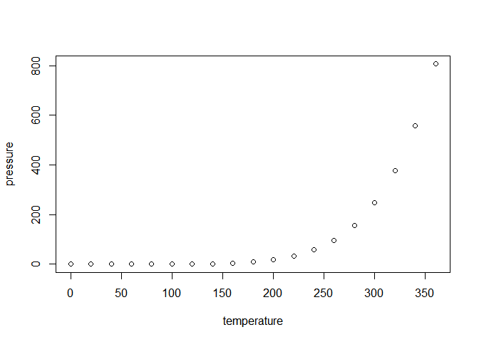

This project ....

Set working directory to source file location. Then, install and load libraries:

``` r
if(!(require(dplyr))){install.packages('dplyr')}
library(dplyr)
```

Define a function to show face images:

``` r
showFace <- function(x){
  x %>%
  as.numeric() %>%
  matrix(nrow = 64, byrow = TRUE) %>% 
  apply(2, rev) %>%  
  t %>% 
  image(col=grey(seq(0, 1, length=256)), xaxt="n", yaxt="n") # 256 diffrent intensities between 0 and 1 defined
  }
```

The purpose of this function is to convert a vector with the image into a matrix and fix the issue concerning R function `image` which creates a grid with 90 degree counter-clockwise rotation of the conventional printed layout of a matrix.

Load data with face images:

``` r
dataX <- "olivetti_X.csv" %>% 
  read.csv(header=FALSE) %>% 
  data.frame()
str(dataX, list.len = 5)
#> 'data.frame':    400 obs. of  4096 variables:
#>  $ V1   : num  0.31 0.455 0.318 0.198 0.5 ...
#>  $ V2   : num  0.368 0.471 0.401 0.194 0.545 ...
#>  $ V3   : num  0.417 0.512 0.492 0.194 0.583 ...
#>  $ V4   : num  0.442 0.558 0.529 0.194 0.624 ...
#>  $ V5   : num  0.529 0.595 0.587 0.19 0.649 ...
#>   [list output truncated]
```

The loaded csv file contains data of face images taken between April 1992 and April 1994 at AT&T Laboratories Cambridge. Each row contains data of one image quantized to 256 grey levels between 0 and 1. After loading, the data are converted into the data frame format.

This project Let the data matrix  be *n x p* size, where *n* is the number of data rows and *p* is the number of data columns in this matrix. We can analysis the data matrix by row or column. Each data row represents a sample, and each data column represents a variable. Let us assume that it is centered, i.e. column means have been subtracted and are now equal to zero. Then the *p x p* covariance matrix is given by :

.")

As it is a square symmetric matrix, it can be diagonalised as follows:


where  is a matrix of orthogonal eigenvectors (where each column is an eigenvector) and  is a diagonal matrix with eigenvalues  in the decreasing order from the largest to the smallest value on the diagonal. The eigenvectors determine principal directions or principal axes of the data. The variables corresponding to these principal axes are known as principal components. Projections of the data on the principal axes gives scores of these principal components. The -th principal component is given by -th column of the matrix product . The coordinates of the -th row of  data point in the new PC space are given by the -th row of the matrix product .

If we now perform singular value decomposition of , we obtain a decomposition


 where  is an orthonormal matrix and  is the diagonal matrix of singular values. From here one can easily see that

^T\mathbf{U}\mathbf{S}\mathbf{V}^T/(n-1),")

,")


meaning that right singular vectors  are principal directions and singular values are related to the eigenvalues of covariance matrix via

.")

 Principal components are given by


. If , then columns of  are orthonormal principal directions) determining principal axis. Columns of  are principal components with their scores Singular values  are related to the eigenvalues  of covariance matrix  via

.")

Eigenvalues  show varinaces of the respective PCs.

In statistics, a data point (or observation) is a set of one or more measurements on a single member of a statistical population.

the x-coordinates of projection points

The variance along the x-axis is the variance of the feature (variable?) represented by that axis, i.e. the variance of the x-coordinates of the dataset. To generalise this notion to any line in space: the x-coordinates of the data points are merely their projections on the x-axis. Using this fact, we can easily find that the variance along any line by projecting our points on the unit vector representing the line, and then taking variance of these projections.

If  is n X d mean-centered data matrix, where n is the number of samples (data points?) and d is the number of dimensions (features, variables?)

Including Plots
---------------

You can also embed plots, for example:



![\\mathbf{X} = \\left\[\\begin{array}
{rrr}
1 & 2 & 3 \\\\
4 & 5 & 6 \\\\
7 & 8 & 9
\\end{array}\\right\]
](https://latex.codecogs.com/png.latex?%5Cmathbf%7BX%7D%20%3D%20%5Cleft%5B%5Cbegin%7Barray%7D%0A%7Brrr%7D%0A1%20%26%202%20%26%203%20%5C%5C%0A4%20%26%205%20%26%206%20%5C%5C%0A7%20%26%208%20%26%209%0A%5Cend%7Barray%7D%5Cright%5D%0A "\mathbf{X} = \left[\begin{array}
{rrr}
1 & 2 & 3 \\
4 & 5 & 6 \\
7 & 8 & 9
\end{array}\right]
")


")


Note that the `echo = FALSE` parameter was added to the code chunk to prevent printing of the R code that generated the plot. try

one  two

asd cf  rsd
